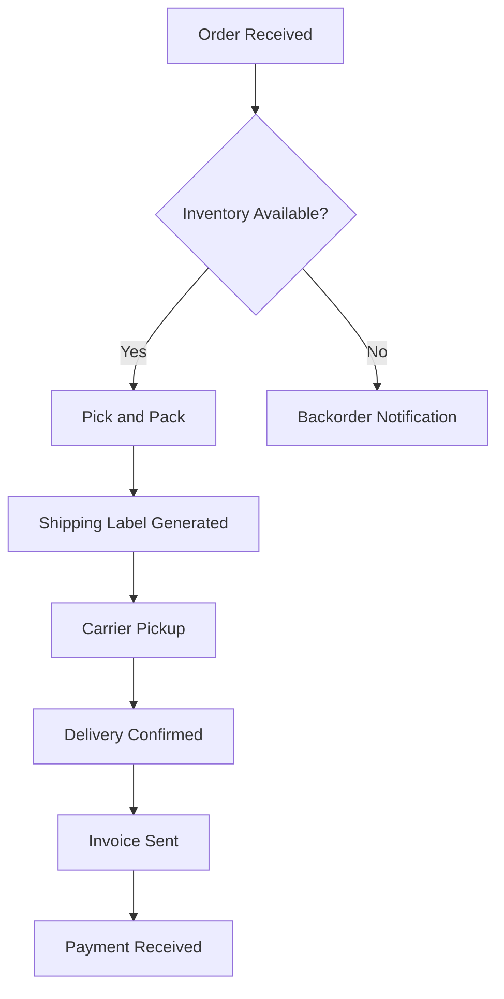

# Business Process

## Overview

A business process is a structured, repeatable set of activities that transforms inputs into outputs to achieve a specific organizational goal. Business processes define how work gets done within an organization—spanning from the moment a customer places an order to the moment they receive their product, or from a job application being submitted to a hiring decision being made. They are the operational backbone of any enterprise, providing consistency, predictability, and measurable outcomes where individual tasks might otherwise be performed arbitrarily.

Business processes exist at every level of an organization. Strategic processes like annual planning set the direction for the entire enterprise. Operational processes like order fulfillment, customer support, and software deployment run continuously. Supporting processes like HR onboarding and financial reporting enable the operational processes to function smoothly. The formalization and systematic management of these processes is what transforms a collection of individuals doing ad-hoc work into a functioning organization capable of scaling.

## Key Concepts

### Process Definition and Documentation

A well-defined business process specifies the sequence of activities, the inputs required, the outputs produced, the actors (people or systems) responsible for each step, decision points, and the expected time or resource constraints. Documentation formats range from simple flowcharts to more rigorous notations like BPMN (Business Process Model and Notation), which provides a standardized visual language with well-defined semantics for events, activities, gateways, and flows.



### Process vs Workflow vs Orchestration

While these terms overlap, there are important distinctions:

- **Process**: A general-purpose term for any structured set of activities achieving a goal. Emphasizes the end-to-end flow and the business logic behind it.
- **Workflow**: Often used more narrowly to describe the movement of work items (documents, tasks, cases) through a sequence of steps. Workflows are frequently human-centric and may be managed by workflow engines or case management systems.
- **[[orchestration]]**: Refers specifically to the coordinated execution of multiple services or subprocesses, often programmatically. In microservices architectures, orchestration involves directing how services interact to accomplish a larger task. This is distinct from [[choreography]], where services communicate peer-to-peer without a central conductor.

### Process Optimization and Redesign

Organizations continuously improve their processes through techniques like:

- **Lean**: Eliminating waste (waiting, rework, unnecessary motion) to increase efficiency
- **Six Sigma**: Using statistical methods to reduce variation and defects
- **Business Process Reengineering (BPR)**: Radically redesigning core processes from the ground up for dramatic performance improvements
- **Process Mining**: Using event logs from information systems to discover, monitor, and improve processes by extracting knowledge from system data

### Automation and BPM Systems

Business Process Management (BPM) systems provide platforms for designing, executing, monitoring, and optimizing business processes. Modern BPM suites support human workflow, system integration, rules engines, and analytics. Process automation often involves [[robotic-process-automation]] (RPA) for automating repetitive rule-based tasks, and increasingly, AI-augmented process automation that can handle semi-structured data and make context-dependent decisions.

## How It Works

Business processes are typically designed using a lifecycle approach:

1. **Identification**: Discover and map existing processes, often through stakeholder interviews and system log analysis
2. **Documentation**: Capture process details in a standardized format (BPMN, flowcharts, SOPs)
3. **Analysis**: Identify bottlenecks, inefficiencies, compliance risks, and improvement opportunities
4. **Redesign**: Modify the process flow, responsibilities, or technology support to address issues
5. **Implementation**: Deploy the redesigned process, train participants, and update systems
6. **Monitoring**: Track KPIs (cycle time, throughput, error rate) to ensure the process performs as expected
7. **Continuous Improvement**: Iterate based on monitoring data and changing business requirements

## Practical Applications

- **Order-to-Cash**: The complete cycle from customer order through payment receipt
- **Procure-to-Pay**: Purchasing goods and services from suppliers and processing payments
- **Hire-to-Retire**: HR lifecycle from recruitment through employee departure
- **Issue Tracking**: Handling customer complaints from submission to resolution
- **Software Deployment**: CI/CD pipeline from code commit to production release

## Examples

```yaml
# Example: Simple process definition in YAML
order_fulfillment:
  name: "Order Fulfillment Process"
  version: "2.1"
  steps:
    - id: validate_order
      actor: order_service
      next: check_inventory
    - id: check_inventory
      actor: inventory_service
      decision: available
      branches:
        available:
          - reserve_inventory
          - generate_packing_slip
        unavailable:
          - notify_customer
          - set_backorder
    - id: ship_order
      actor: fulfillment_center
      next: confirm_delivery
    - id: confirm_delivery
      actor: logistics_service
      triggers: invoice_generation
  sla:
    fulfillment_time: "P2D"  # 2 days
    max_backorder_days: 7
```

## Related Concepts

- [[workflow]] — Human-centric task routing and case management
- [[orchestration]] — Programmatic coordination of distributed services
- [[business-process-automation]] — Automating repetitive business processes
- [[process-mining]] — Event-driven discovery and analysis of actual process execution
- [[bpmn]] — Standard notation for business process modeling

## Further Reading

- Dumas, Marlon, et al. *Fundamentals of Business Process Management* (2018)
- Hammer, Michael, and James Champy. *Reengineering the Corporation* (1993)
- Weske, Mathias. *Business Process Management* (2019)
- van der Aalst, Wil M.P. *Process Mining: Data Science in Action* (2016)

## Personal Notes

I find process thinking invaluable when debugging distributed systems—understanding the business process helps identify which component failures would be catastrophic vs. acceptable. The distinction between orchestration and choreography is particularly useful in microservices design. Also, process documentation decays fast; treat it as a living artifact that needs regular maintenance rather than a one-time deliverable.
