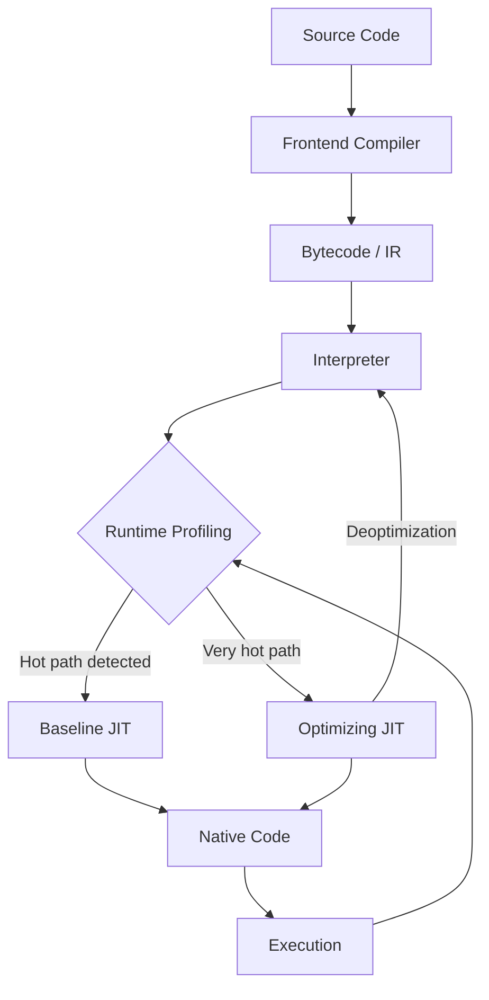

# Just In Time Compilation

## Overview

Just-In-Time (JIT) compilation is a runtime technique where a compiler translates source code or bytecode into highly optimized machine code at the moment it is needed—during program execution—rather than ahead of time before the program runs. The "just in time" refers to the moment of execution: the compiler defers compilation until the program actually needs to run a particular code path, then compiles it on the fly. This approach combines the benefits of interpretation (fast startup, portability) with the performance of native machine code (fast execution), and adds a third benefit unique to JIT: runtime profiling enables aggressive optimizations that static compilers cannot perform.

JIT compilation is the execution engine of most modern managed runtimes: the Java Virtual Machine (JVM), Microsoft's Common Language Runtime (CLR) for .NET, JavaScript engines like V8 and SpiderMonkey, and PyPy's Python implementation. It is one of the most important performance innovations in language runtimes, enabling dynamically typed, interpreted-feeling languages to achieve performance competitive with statically compiled languages in hot, frequently executed code paths.

## Key Concepts

### Interpretation vs AOT vs JIT

Understanding JIT requires seeing it in the landscape of code execution strategies:

| Approach | When Compiled | Output | Startup | Runtime Performance |
|----------|---------------|--------|---------|-------------------|
| **Interpretation** | None (executes directly) | Source or bytecode | Fast | Slower — each instruction decoded repeatedly |
| **Ahead-of-Time (AOT)** | Before execution | Native machine code | Slower (must compile first) | Good, but no runtime profile data |
| **JIT** | During execution | Native machine code | Fast (start interpreted) | Excellent for hot paths, based on real profiling |

### Hot Paths and Profiling

JIT compilers use runtime profiling to identify "hot paths"—the code that is executed most frequently. The most famous heuristic is the "on-stack replacement" (OSR) loop counter: once a method or loop is executed N times (e.g., 10,000 in V8), the JIT compiler prioritizes compiling it. Because the JIT compiler knows the actual runtime types, branch frequencies, and memory access patterns, it can apply optimizations that static compilers cannot:

- **Inline caching**: Cache the results of method lookups and type checks
- **Speculative inlining**: Assume a particular type and inline accordingly, deoptimizing if the assumption is violated
- **Dead code elimination**: Remove code paths that profiling shows are never taken
- **Escape analysis**: Determine whether objects can be stack-allocated instead of heap-allocated

### Tiered Compilation

Modern JIT compilers use multiple tiers of compilation, trading off compilation time against optimization level:

1. **Interpreter**: Executes bytecode immediately with minimal overhead. Fast startup.
2. **Baseline JIT**: Quick compilation to simple machine code. Decent performance, fast compile time.
3. **Optimizing JIT**: Deep analysis and aggressive optimizations. Slower to compile but produces highly optimized code for truly hot paths.

For example, V8 uses Ignition (interpreter) + TurboFan (optimizing JIT). JVM uses C1 (client compiler, baseline) + C2 (server compiler, optimizing).

### Deoptimization

A critical feature of JIT compilers is the ability to "deoptimize"—throw away generated code and fall back to interpretation or less-optimized code. This is necessary when the JIT makes speculative assumptions (e.g., "this variable will always be type int") that turn out to be wrong at runtime. Deoptimization ensures correctness while allowing aggressive speculation.

```python
# Python example of how JIT deoptimization might work conceptually
# (CPython doesn't use JIT, but this illustrates the concept)

# Hot function that JIT might specialize
def sum_list(items):
    total = 0
    for item in items:
        total += item
    return total

# JIT observes: items is always list[int] for 10000 iterations
# JIT compiles specialized version assuming int types
# Suddenly items becomes list[float] — JIT must deoptimize
# Falls back to generic version
```

## How It Works

A typical JIT compilation pipeline:



1. Program starts executing in interpreter, profiling data is collected
2. Hot methods are submitted for baseline JIT compilation
3. Very hot methods with stable profiles go through optimizing JIT
4. Generated code is executed; profiling continues
5. If assumptions are violated (e.g., new type seen), code is deoptimized
6. The cycle continues dynamically throughout program execution

## Practical Applications

- **Java/JVM Applications**: JIT (HotSpot) enables Java to match C++ performance in long-running server applications
- **JavaScript in Browsers**: V8's JIT makes JavaScript one of the fastest dynamic languages
- **.NET Applications**: CLR's JIT enables cross-platform .NET with near-native performance
- **Databases**: JIT compilation of query plans in systems like PostgreSQL and HyPer
- **Machine Learning**: JIT-compiled operators in frameworks like PyTorch and TensorFlow for fast tensor computation

## Examples

```java
// Example: JIT compilation behavior demonstration (Java)
// Running with: java -XX:+PrintCompilation -XX:+UnlockDiagnosticVMOptions -XX:+PrintInlining

public class JitDemo {
    // This method will be JIT compiled after enough iterations
    public static long sumRange(long n) {
        long sum = 0;
        for (long i = 0; i <= n; i++) {
            sum += i;
        }
        return sum;
    }

    public static void main(String[] args) {
        // Warmup phase — trigger interpretation and profiling
        for (int i = 0; i < 100_000; i++) {
            sumRange(1000);
        }
        // Now the hot loop will be JIT compiled
        long result = sumRange(10_000_000);
        System.out.println("Result: " + result);
    }
}
```

```bash
# Running with JIT logging shows compilation decisions:
# $ java -XX:+PrintCompilation JitDemo
# ...
#  125  131 %     3 JitDemo::sumRange @ 7 (36 bytes)  # <- % means OSR compilation
#   127  132       3       org.example.JitDemo::sumRange (36 bytes)
#   129  133       3       sun.nio.cs.UTF_8$Decoder::decode (63 bytes)
```

## Related Concepts

- [[interpreters]] — Runtime execution strategies for bytecode and source
- [[compilers]] — Traditional ahead-of-time compilation pipelines
- [[virtual-machines]] — Managed runtimes that often include JIT engines
- [[performance-optimization]] — Profiling and tuning managed runtime applications
- [[graalvm]] — Advanced JIT/AOT compiler ecosystem including native image support

## Further Reading

- Chambers, Craig, et al. "Optimizing dynamically-typed object-oriented languages." *OOPSLA* (1991) — Early JIT optimization ideas
- Hölzle, Urs, and David Ungar. "Optimizing dynamically-dispatched calls with run-time type feedback." *OOPSLA* (1994) — Inline caching explained
- V8 Blog: https://v8.dev/blog — In-depth articles on V8's JIT and optimizing compiler (TurboFan)
- "The Java Language Specification, Chapter 12: Execution" — Covers dynamic compilation and class loading

## Personal Notes

The most counterintuitive thing about JIT is that it makes programs get faster over time—you run a program and after some warmup period it actually accelerates. This "phase change" behavior can make benchmarking tricky: you need to warm up the JVM before measuring. The deoptimization story is also fascinating—when a JIT assumption breaks, the system gracefully falls back without crashing, which is a remarkable feat of engineering.
