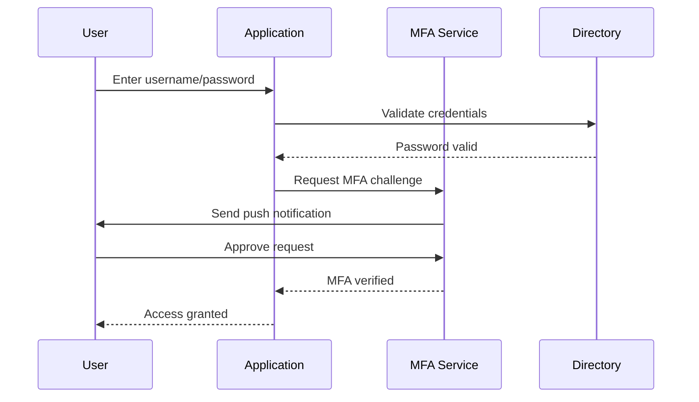

# Multi-Factor Authentication (MFA)

## Overview

Multi-Factor Authentication (MFA) is a security mechanism that requires users to provide two or more verification factors to gain access to a resource, such as an application, account, or network. By combining multiple independent credentials—what you know (password), what you have (security token), and what you are (biometric)—MFA significantly reduces the risk of unauthorized access even if one factor (typically the password) is compromised. It represents a fundamental shift from single-factor authentication toward a defense-in-depth approach that assumes credentials will inevitably be breached.

MFA has become a critical component of modern security architecture, recommended or required by virtually every major security framework including NIST guidelines, PCI-DSS, SOC 2, and ISO 27001. Organizations implementing MFA see dramatic reductions in account compromise rates—studies suggest MFA can prevent over 99% of automated attacks and significantly reduce the success of credential stuffing and phishing campaigns.

## Key Concepts

### Authentication Factors

MFA relies on combining factors from these categories:

1. **Knowledge Factor (Something You Know)**: Passwords, PINs, security questions
2. **Possession Factor (Something You Have)**: Hardware tokens, smartphones, smart cards
3. **Inherence Factor (Something You Are)**: Fingerprints, facial recognition, iris scans, voice recognition

### Common MFA Methods

**Authenticator Apps** (TOTP/HOTP):
- Time-based One-Time Passwords (TOTP) generate 6-8 digit codes that change every 30 seconds
- Apps like Google Authenticator, Authy, and Microsoft Authenticator
- More secure than SMS since codes aren't intercepted

**Hardware Security Keys**:
- Physical devices like YubiKey, Titan Security Key
- Support FIDO2/WebAuthn standards
- Resistant to phishing and replay attacks

**SMS/Voice MFA**:
- Codes sent via text message or phone call
- Being phased out due to SIM swapping vulnerabilities
- Still better than no MFA but not recommended for high-security accounts

**Push Notifications**:
- Approval requests sent to a registered device
- User simply approves or denies the login attempt
- Used by Duo, Okta, and many banking apps

### Adaptive/ Risk-Based Authentication

Modern MFA systems evaluate context to determine required factors:

- Geographic location and IP address
- Device recognition and trust state
- Time of access and behavioral patterns
- Risk scoring based on threat intelligence

## How It Works

When a user attempts to log in with MFA enabled:



The system first validates the password (knowledge factor), then triggers the second factor challenge. Only after both factors are successfully verified is access granted.

## Practical Applications

MFA is essential across many scenarios:

- **Corporate VPN Access**: Remote employees accessing internal systems
- **SaaS Applications**: Microsoft 365, Salesforce, Google Workspace
- **Financial Services**: Online banking, trading platforms, payment processing
- **Healthcare Systems**: EHR access, prescription systems (HIPAA compliance)
- **Developer Resources**: Code repositories, cloud consoles, CI/CD pipelines

## Examples

Implementing MFA in a web application using TOTP:

```python
import pyotp

# Setup: Generate a secret for new user
def setup_mfa(user):
    secret = pyotp.random_base32()
    # Store encrypted secret in database
    db.users.update(user.id, {mfa_secret: encrypt(secret)})
    
    # Generate provisioning URI for authenticator app
    totp = pyotp.TOTP(secret)
    provisioning_uri = totp.provisioning_uri(
        name=user.email,
        issuer_name="MyApplication"
    )
    return provisioning_uri  # Show as QR code

# Verification: Validate TOTP code
def verify_mfa(user, code):
    secret = decrypt(db.users.get(user.id).mfa_secret)
    totp = pyotp.TOTP(secret)
    return totp.verify(code)  # Validates within time window
```

## Related Concepts

- [[authentication]] — Primary identity verification methods
- [[password-security]] — Password best practices and breach prevention
- [[zero-trust]] — Security model based on "never trust, always verify"
- [[identity-provider]] — Systems managing user identities (Okta, Auth0)
- [[phishing]] — Attack vector MFA helps mitigate

## Further Reading

- [NIST Digital Identity Guidelines](https://pages.nist.gov/800-63-3/)
- [FIDO Alliance Standards](https://fidoalliance.org/)
- [CISA MFA Guide](https://www.cisa.gov/mfa)

## Personal Notes

MFA is one of the highest-leverage security investments an organization can make. I've seen companies go from constant account takeover incidents to nearly zero after deploying hardware keys. The usability trade-offs have improved dramatically with passkeys and push notifications. My recommendation: skip SMS MFA if possible, use authenticator apps as a minimum, and deploy hardware keys for high-value accounts. The cost is trivial compared to the breach risk.
